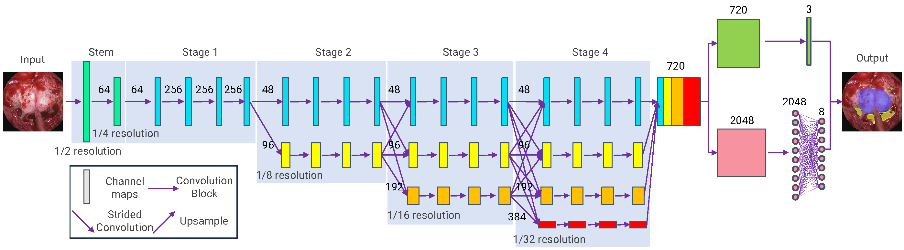
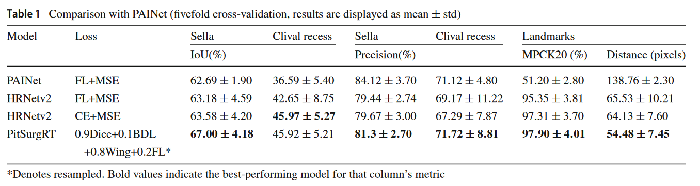
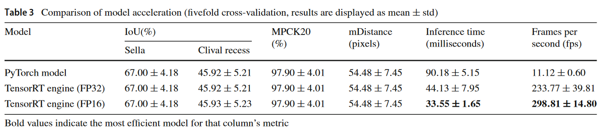

# PitSurgRT: real-time localization of critical anatomical structures in endoscopic pituitary surgery
### [Paper](https://doi.org/10.1007/s11548-024-03094-2) | [BibTex](#citation)

## Abstract

Endoscopic pituitary surgery entails navigating through the nasal cavity and sphenoid sinus to access the sella using an endoscope. This procedure is intricate due to the proximity of crucial anatomical structures (e.g. carotid arteries and optic nerves) to pituitary tumours, and any unintended damage can lead to severe complications including blindness and death. Intraoperative guidance during this surgery could support improved localization of the critical structures leading to reducing the risk of complications. A deep learning network PitSurgRT is proposed for real-time localization of critical structures in endoscopic pituitary surgery. The network uses High-Resolution Net (HRNet) as a backbone with a multi-head for jointly localizing critical anatomical structures while segmenting larger structures simultaneously. Moreover, the trained model is optimized and accelerated by using TensorRT. Finally, the model predictions are shown to neurosurgeons, to test their guidance capabilities. Compared with the state-of-the-art method, our model significantly reduces the mean error in landmark detection of the critical structures from 138.76 to 54.40 pixels in a 1280 $\times$ 720-pixel image. Furthermore, the semantic segmentation of the most critical structure, sella, is improved by 4.39\% IoU. The inference speed of the accelerated model achieves 298 frames per second with floating-point-16 precision. In the study of 15 neurosurgeons, 88.67\% of predictions are considered accurate enough for real-time guidance. The results from the quantitative evaluation, real-time acceleration, and neurosurgeon study demonstrate the proposed method is highly promising in providing real-time intraoperative guidance of the critical anatomical structures in endoscopic pituitary surgery.

## Clinical Motivation
<div align="center">
  
  <p> Critical anatomical structures as present during the sellar phase of endoscopic pituitary surgery. Sella (1) and Clival Recess (2) are relatively bigger structures and easy to identify. Carotids (3 left, 6 right) and Optic Protuberance (4 left, 5 right) are critical neurovascular structures to be avoided.</p>
</div>

## Contributions
* Based on the HRNet, we proposed a multitask network named PitSurgRT that can solve the anatomy segmentation and landmark detection simultaneously in endoscopic pituitary surgery.
* An effective loss function that combines four losses is proposed in this paper to solve the issue of the highly imbalanced dataset for the training.
* Through the 5-fold cross-validation based on the in-vivo dataset, the proposed PitSurgRT is demonstrated to significantly improve the landmark detection and semantic segmentation of the critical anatomical structures in the sellar phase of endoscopic pituitary surgery compared with our previous work PAINet.
* The proposed model is accelerated by using the TensorRT technique to achieve real-time intraoperative guidance. The results are verified by 15 neurosurgeons.

## Architecture
<div align="center">
  
  <p>The architecture of PitSurgRT for simultaneous segmentation and landmark detection.</p>
</div>

## Implementation and running
The proposed method is implemented using PyTorch 1.12.0 on Python 3.8.17.

To install Pytorch, please refer to [Pytorch](https://pytorch.org/).

In our experiments, we install the following Pytorch version for GPU : 
```
pip install torch==1.12.0+cu116 torchvision==0.13.0+cu116 torchaudio==0.12.0 --extra-index-url https://download.pytorch.org/whl/cu116
``` 
'Pit_train.py' script is used to run the training process.

'Pit_test.py' script is used the do the inference on input images, it will overlay the predication and ground truth (if you have them) on images and save them for visualization.

## Results
### Segmenation and Landmartk Detection Performance
<div align="center">
  
</div>

### Real-time performance
<div align="center">
  
</div>

### Clinical validation
<div align="center">
  
  <p>Clinical validation results in which 4 consultant neurosurgeons and 11 trainee neurosurgeons participated to validate the accuracy of PitSurgRT on surgical images from 10 patients.</p>
</div>

<!-- ---------------------------------------------- -->
## Citation
If any part of our paper and repository is helpful to your work, please generously cite with:
```
@article{mao2024pitsurgrt,
  title={PitSurgRT: real-time localization of critical anatomical structures in endoscopic pituitary surgery},
  author={Mao, Zhehua and Das, Adrito and Islam, Mobarakol and Khan, Danyal Z and Williams, Simon C and Hanrahan, John G and Borg, Anouk and Dorward, Neil L and Clarkson, Matthew J and Stoyanov, Danail and others},
  journal={International Journal of Computer Assisted Radiology and Surgery},
  pages={1--8},
  year={2024},
  publisher={Springer}
}
```
## Contact
If you have any questions or suggestions about this paper, feel free to contact me (z.mao@ucl.ac.uk).
